# Bitnano - Documentation <!-- omit in toc -->

> Note: The docs are also available here: [https://nuicet.github.io/bitnano-zli/](https://nuicet.github.io/bitnano-zli/)

## Table of contents <!-- omit in toc -->

- [Introduction](#introduction)
- [The idea](#the-idea)
  - [Description](#description)
  - [UML Diagrams](#uml-diagrams)
  - [Use case diagram](#use-case-diagram)
  - [Class Diagram](#class-diagram)
- [Time schedule](#time-schedule)
- [Realization](#realization)
  - [Core](#core)
    - [Block](#block)
      - [Hash calculation](#hash-calculation)
      - [Block mining](#block-mining)
    - [Blockchain](#blockchain)
      - [Connection between Blocks](#connection-between-blocks)
      - [Don't trust, verify](#dont-trust-verify)
      - [Pending transaction](#pending-transaction)
  - [Client](#client)
    - [Choose/create Wallet](#choosecreate-wallet)
- [Getting started](#getting-started)
  - [Node.js](#nodejs)
  - [Config files](#config-files)
- [Starting the core/client](#starting-the-coreclient)
  - [Testing](#testing)
    - [Core](#core-1)
    - [Client](#client-1)
- [Test cases](#test-cases)
- [Reflection](#reflection)
  - [Block time](#block-time)
  - [Block size](#block-size)
  - [The mempool as a peer-to-peer network](#the-mempool-as-a-peer-to-peer-network)
  - [Memory problems with NodeJS](#memory-problems-with-nodejs)
  - [My time in ZLI](#my-time-in-zli)
  - [In Summary](#in-summary)

## Introduction

The Bitcoin protocol is the most popular cryptographic protocol worldwide. Since I am a big fan of Bitcoin and its protocol, I always wanted to create something similar my own. This is how i came to [the idea](#the-idea) of Bitnano as a final project in the Zürcher Lehrbetriebsverband ICT.

## The idea

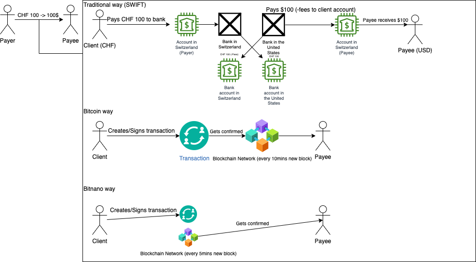

### Description

Traditional banks need time and trust to process a transfer. Bitcoin replaces (central) banks with a decentral Blockchain. In the Bitcoin Blockchain, a Block has a maximum size of **1 MiB**. Approximately every **10 minutes** a new Block gets mined.
The idea of Bitnano is to create a faster Blockchain, but with a lower size of Blocks. The maximum size of a Bitnano-Block is **512 KiB**, with an average time of **5 minutes** per Block to mine.

For more information about the Bitcoin-Protocol: [https://bitcoin.org/bitcoin.pdf](https://bitcoin.org/bitcoin.pdf)

### UML Diagrams

### Use case diagram

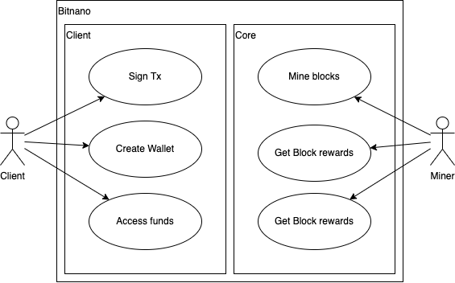

### Class Diagram

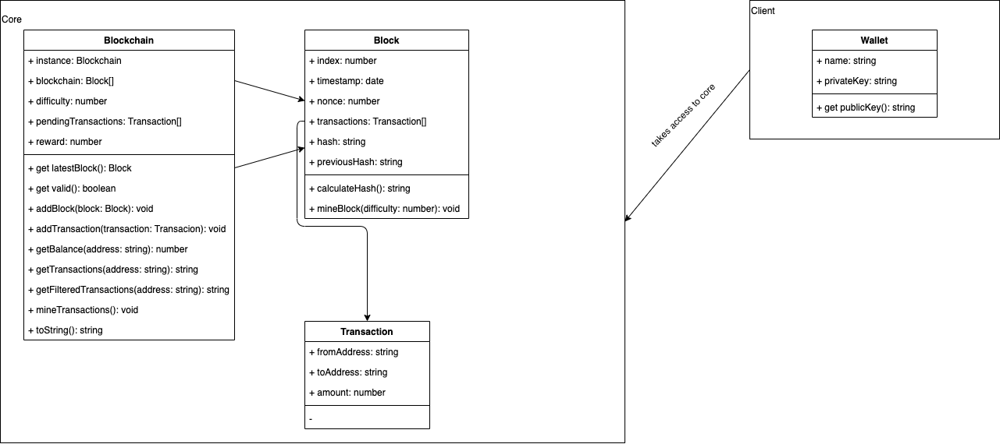

## Time schedule

[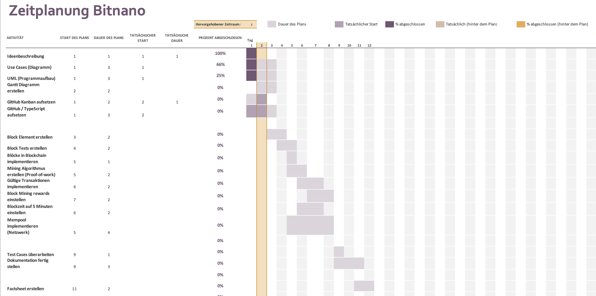](assets/03-time.png)

## Realization

### Core

For the core implementation, I got inspiration from this [YouTube Playlist](https://www.youtube.com/playlist?list=PLzvRQMJ9HDiTqZmbtFisdXFxul5k0F-Q4). But he did it without Typescript and had no implemented client.

#### Block

The idea of a block, is to include transactions and getting mined by miners. As in Bitcoin, I wanted blocks including a hash and transactions. So I designed the [UML](#uml-diagrams) for the block and started programming immediately. I think there is nothing much more to say, as i got my inspiration from [Youtube](https://www.youtube.com/playlist?list=PLzvRQMJ9HDiTqZmbtFisdXFxul5k0F-Q4).

##### Hash calculation

To calculate a Block hash, I used a simple 256-bit SHA algorithm. The functionality looks like this:

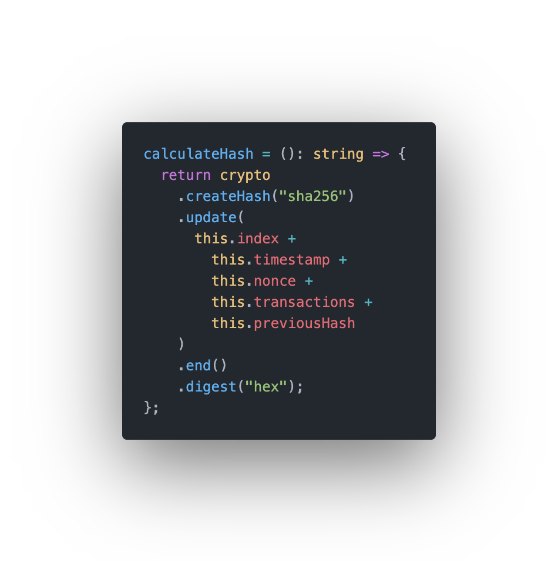

It's not really that hard, just implementation from the existing node.js [crypto](https://nodejs.org/api/crypto.html) library.

##### Block mining

To mine a block, you'll have to get the blockchains difficulty by providing it to the method. The difficulty is being set, by only allowing hashes, with a specific amount of zeros. For example: `000000000019d6689c085ae165831e934ff763ae46a2a6c172b3f1b60a8ce26f`<br>
After that, it really isn't hard to start the mining, it's just luck and performance. That's how proof-of-work works.

> For more information about the proof-of-work algorithm, see [https://bitcoin.org/bitcoin.pdf](https://bitcoin.org/bitcoin.pdf)

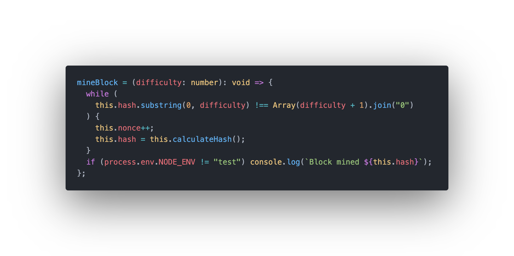

#### Blockchain

##### Connection between Blocks

As in every proof-of-work blockchain, the blocks are connected with their hash including the hash of the block before. For example:

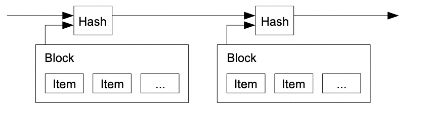
Source: https://bitcoin.org/bitcoin.pdf

##### Don't trust, verify

To verify the blockchain, you can just recalculate the blocks with the same properties as the already calculated hash and compare it. With this, you don't have to trust and verify everything yourself.

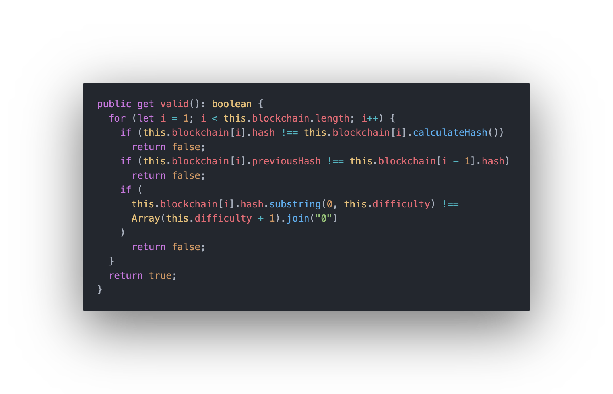

##### Pending transaction

Pending transactions are currently being saved in a JSON file. The core reads that file and includes the pending transaction into newly mined blocks. Afterwards, the pending transactions get purged.

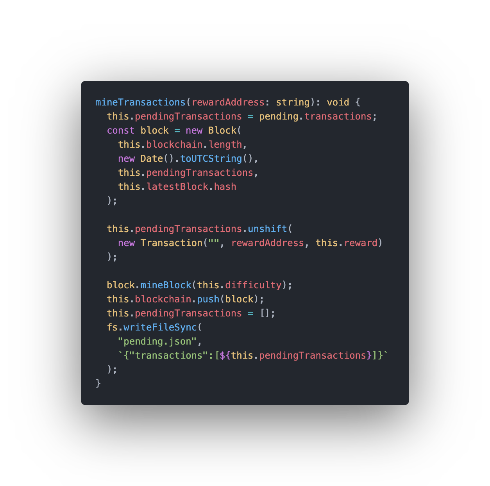

### Client

The idea of the client is to manage wallets and create transactions. After some considerations, I came to following CLI Design:

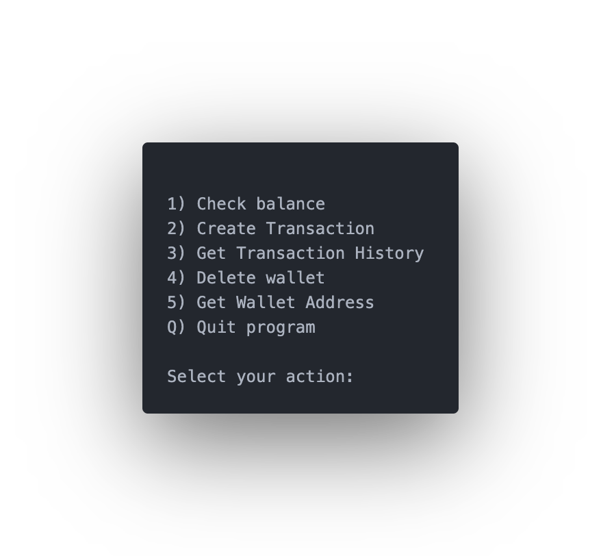

#### Choose/create Wallet

After starting the client, you should be able to choose between multiple wallets or create a new one. The private keys will be saved into a JSON file

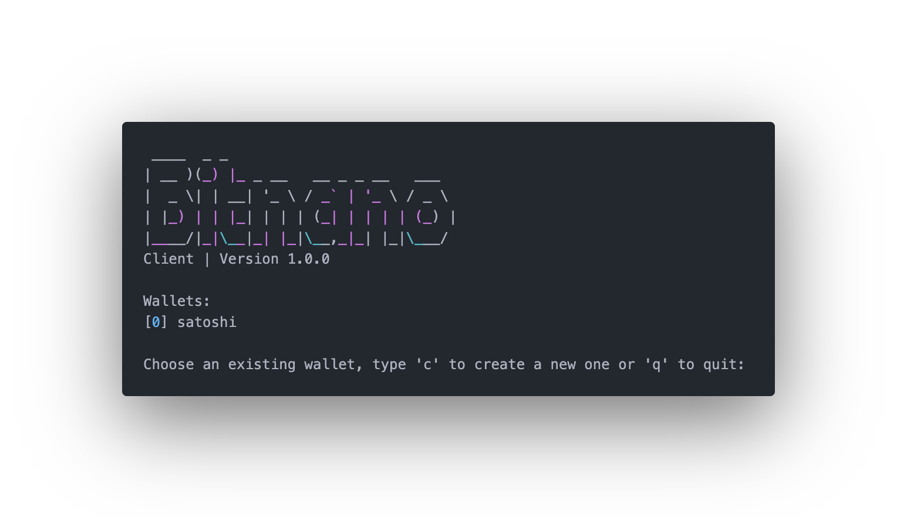

## Getting started

> Note: Everything is also being described [here](../README.md)

### Node.js

If you're using nvm, make it use the specified version:

```bash
nvm use
```

Install the dependencies:

_with npm:_

```bash
npm install
```

_or with yarn:_

```bash
yarn install
```

### Config files

To start the client/core properly, you'll need to initialize the config files:

```sh
sh initrc
```

> Note: If you are on Windows, you'll need to use WSL in order to execute the script properly. <br> See: https://docs.microsoft.com/en-us/windows/wsl/install > <br><br>_It may run properly with [Git bash](https://gitforwindows.org/), but wasn't tested yet._

## Starting the core/client

Then run the **core**:

_with npm:_

```bash
npm run start:core
```

_or with yarn:_

```bash
yarn start:core
```

> Note: By starting the core, your machine will be automatically used to mine in the blockchain.

After that run the **client:**
_with npm:_

```bash
npm run start:client
```

_or with yarn:_

```bash
yarn start:client
```

### Testing

> The test cases are available [here](https://nuicet.github.io/bitnano-zli#test-cases).

#### Core

_with npm:_

```bash
npm run test:core
```

_or with yarn:_

```bash
yarn test:core
```

#### Client

_with npm:_

```bash
npm run test:client
```

_or with yarn:_

```bash
yarn test:client
```

## Test cases

<table>
  <tr>
    <th>Testcase No.</th>
    <td><strong>1</strong></td>
  </tr>
  <tr>
    <th>Description</th>
    <td>User can create wallet</td>
  </tr> 
  <tr>
    <th>Requirements</th>
    <td>Client started</td>
  </tr>
  <tr>
    <th>Steps</th>
    <td>
    > Type "c"
    <br/>
    > Press enter
    <br/>
    > Type "4"
    <br/>
    > Enter
    <br/>
    > Type "y" to confirm
    <br/>
    > Start client again
    </td>
  </tr> 
  <tr>
    <th>Expected result</th>
    <td>Wallet "test" should <strong>not</strong> be shown in the list</td>
  </tr>
  <tr>
    <th>Test result</th>
    <td style="color: green">success</td>
  </tr>  
  <tr>
    <th>Test date</th>
    <td>15th June 2022</td>
  </tr>  
  <tr>
    <th>Remark</th>
    <td></td>
  </tr>
</table>
<table>
  <tr>
    <th>Testcase No.</th>
    <td><strong>2</strong></td>
  </tr>
  <tr>
    <th>Description</th>
    <td>User can delete wallet</td>
  </tr> 
  <tr>
    <th>Requirements</th>
    <td>Test case 1</td>
  </tr>
  <tr>
    <th>Steps</th>
    <td>
    > Start client
    <br/>
    > Select wallet "test"
    <br/>
    > Type "test"
    <br/>
    > Press enter
    <br/>
    > Start client again
    </td>
  </tr> 
  <tr>
    <th>Expected result</th>
    <td>Wallet "test" should be shown in the list</td>
  </tr>
  <tr>
    <th>Test result</th>
    <td style="color: green">success</td>
  </tr>  
  <tr>
    <th>Test date</th>
    <td>15th June 2022</td>
  </tr>  
  <tr>
    <th>Remark</th>
    <td></td>
  </tr>
</table>
<table>
  <tr>
    <th>Testcase No.</th>
    <td><strong>3</strong></td>
  </tr>
  <tr>
    <th>Description</th>
    <td>User can create transaction</td>
  </tr> 
  <tr>
    <th>Requirements</th>
    <td>Change reward address in blockchain.ts to your public key</td>
  </tr>
  <tr>
    <th>Steps</th>
    <td>
    > Start core
    <br/>
    > Start client
    <br/>
    > Select your wallet
    <br/>
    > Type "2"
    <br/>
    > Press enter
    <br/>
    > Type a random address (e.g. "420")
    <br/>
    > Press enter
    <br/>
    > Wait until next block mined
    <br/>
    > Stop the core
    <br/>
    > Start client again
    <br/>
    > Check transaction history
    </td>
  </tr> 
  <tr>
    <th>Expected result</th>
    <td>The transaction should be included in the history</td>
  </tr>
  <tr>
    <th>Test result</th>
    <td style="color: green">success</td>
  </tr>  
  <tr>
    <th>Test date</th>
    <td>15th June 2022</td>
  </tr>  
  <tr>
    <th>Remark</th>
    <td></td>
  </tr>
</table>
<table>
  <tr>
    <th>Testcase No.</th>
    <td><strong>4</strong></td>
  </tr>
  <tr>
    <th>Description</th>
    <td>User can get wallet address</td>
  </tr> 
  <tr>
    <th>Requirements</th>
    <td>Create a wallet</td>
  </tr>
  <tr>
    <th>Steps</th>
    <td>
    > Start client
    <br/>
    > Select your wallet
    <br/>
    > Type "5"
    <br/>
    > Press enter
    </td>
  </tr> 
  <tr>
    <th>Expected result</th>
    <td>The address should look something like this: 046fbd5b01396d39ea4ddd52bb1717b58de28c858adc93147defa9d4e18f37c959c744145e23102cb05565548735d372ad45f4f1bed856167aadd988ceb8586fc8</td>
  </tr>
  <tr>
    <th>Test result</th>
    <td style="color: green">success</td>
  </tr>  
  <tr>
    <th>Test date</th>
    <td>15th June 2022</td>
  </tr>  
  <tr>
    <th>Remark</th>
    <td></td>
  </tr>
</table>
<table>
  <tr>
    <th>Testcase No.</th>
    <td><strong>5</strong></td>
  </tr>
  <tr>
    <th>Description</th>
    <td>Can start core</td>
  </tr> 
  <tr>
    <th>Requirements</th>
    <td>yarn/npm install (for more information, see Getting started.</td>
  </tr>
  <tr>
    <th>Steps</th>
    <td>
    > sh initrc
    <br/>
    > Start core
    </td>
  </tr> 
  <tr>
    <th>Expected result</th>
    <td>The console should log the blocks getting mined. For example: Block mined: [Hash of the block]</td>
  </tr>
  <tr>
    <th>Test result</th>
    <td style="color: green">success</td>
  </tr>  
  <tr>
    <th>Test date</th>
    <td>15th June 2022</td>
  </tr>  
  <tr>
    <th>Remark</th>
    <td></td>
  </tr>
</table>
<table>
  <tr>
    <th>Testcase No.</th>
    <td><strong>6</strong></td>
  </tr>
  <tr>
    <th>Description</th>
    <td>User getting mine rewards</td>
  </tr> 
  <tr>
    <th>Requirements</th>
    <td>Testcase no. 5</td>
  </tr>
  <tr>
    <th>Steps</th>
    <td>
    > Change reward address in blockchain.ts
    <br/>
    > Start core
    <br/>
    > Start client
    <br/>
    > Check transaction history
    </td>
  </tr> 
  <tr>
    <th>Expected result</th>
    <td>Block reward should be included in transaction history</td>
  </tr>
  <tr>
    <th>Test result</th>
    <td style="color: green">success</td>
  </tr>  
  <tr>
    <th>Test date</th>
    <td>15th June 2022</td>
  </tr>  
  <tr>
    <th>Remark</th>
    <td></td>
  </tr>
</table>
<table>
  <tr>
    <th>Testcase No.</th>
    <td><strong>7</strong></td>
  </tr>
  <tr>
    <th>Description</th>
    <td>User can initiate JSON files</td>
  </tr> 
  <tr>
    <th>Requirements</th>
    <td>Bash Terminal</td>
  </tr>
  <tr>
    <th>Steps</th>
    <td>
    > Navigate to source path of project
    <br/>
    > Enter "sh initrc"
    </td>
  </tr> 
  <tr>
    <th>Expected result</th>
    <td>The script should create the files "blockchain.json", "client_data.json" and "pending.json"</td>
  </tr>
  <tr>
    <th>Test result</th>
    <td style="color: green">success</td>
  </tr>  
  <tr>
    <th>Test date</th>
    <td>16th June 2022</td>
  </tr>  
  <tr>
    <th>Remark</th>
    <td></td>
  </tr>
</table>
<table>
  <tr>
    <th>Testcase No.</th>
    <td><strong>8</strong></td>
  </tr>
  <tr>
    <th>Description</th>
    <td>Blockchain is valid</td>
  </tr> 
  <tr>
    <th>Requirements</th>
    <td>yarn/npm install</td>
  </tr>
  <tr>
    <th>Steps</th>
    <td>
    > Start the node script (yarn/npm) run test:core
    </td>
  </tr> 
  <tr>
    <th>Expected result</th>
    <td>Under "⛓ Test Blockchain", the test "✅ Verify valid Blockchain" should be passed.</td>
  </tr>
  <tr>
    <th>Test result</th>
    <td style="color: red">failed</td>
  </tr>  
  <tr>
    <th>Test date</th>
    <td>16th June 2022</td>
  </tr>  
  <tr>
    <th>Remark</th>
    <td>The blockchain must be valid, but because i'm hotfixing some stuff and implementing a very important feature, the test fails.</td>
  </tr>
</table>
<table>
  <tr>
    <th>Testcase No.</th>
    <td><strong>9</strong></td>
  </tr>
  <tr>
    <th>Description</th>
    <td>Block hash being correctly created</td>
  </tr> 
  <tr>
    <th>Requirements</th>
    <td>yarn/npm install</td>
  </tr>
  <tr>
    <th>Steps</th>
    <td>
    > Start the node script (yarn/npm) run test:core
    </td>
  </tr> 
  <tr>
    <th>Expected result</th>
    <td>Under "⛏ Test Block(s)", the test "#️⃣ Block Hash valid" should be passed.</td>
  </tr>
  <tr>
    <th>Test result</th>
    <td style="color: green">success</td>
  </tr>  
  <tr>
    <th>Test date</th>
    <td>16th June 2022</td>
  </tr>  
  <tr>
    <th>Remark</th>
    <td></td>
  </tr>
</table>
<table>
  <tr>
    <th>Testcase No.</th>
    <td><strong>10</strong></td>
  </tr>
  <tr>
    <th>Description</th>
    <td>Transaction signature valid</td>
  </tr> 
  <tr>
    <th>Requirements</th>
    <td>yarn/npm install</td>
  </tr>
  <tr>
    <th>Steps</th>
    <td>
    > Start the node script (yarn/npm) run test:core
    <br/>
    > Enter "sh initrc"
    </td>
  </tr> 
  <tr>
    <th>Expected result</th>
    <td>Under "💵 Test Transactions", the test "💸 Transaction hash valid" should be passed.</td>
  </tr>
  <tr>
    <th>Test result</th>
    <td style="color: aqua">pending</td>
  </tr>  
  <tr>
    <th>Test date</th>
    <td>16th June 2022</td>
  </tr>  
  <tr>
    <th>Remark</th>
    <td>Feature is not implemented yet/ if time is left, I'll implement it.</td>
  </tr>
</table>

> For other test cases for the code, see [Testing](#testing)

## Reflection

In summary, the project was very fun. I learned so much stuff and I actually read the [Bitcoin Whitepaper](https://bitcoin.org/bitcoin.pdf) for the first time completely. I understand better, how blockchains work and can use the new knowledge for the future.
Nevertheless there were some problems and unfinished features:

### Block time

Bitcoin has an average block time of 10 minutes. This is possible by automatically adjusting the difficulty to the average time of the past mined blocks.

In Bitnano, the idea was also to do that automatically, but because of time reasons and knowledge, I couldn't implement the feature.

### Block size

In Bitcoin the max block size is 1MiB (Actually it's 2-3MiB after the network voted for the change). As I mentioned in the [introduction](#description), I wanted to set the max block size in Bitnano to 512 KiB.

That was not possible, because of the programming language I used. In TypeScript (or node.js), it really depends on, where the blocks are saved. For example: 2 Megabytes of data in a JSON can be 3 Megabytes of data in Typescript.

With other programming languages, this woulndn't be a problem, for example [C](<https://en.wikipedia.org/wiki/C_(programming_language)>) is very close to hardware, so you don't have problems with different sizes on memory or disk drives. So I would probalby choose a different programming language next time or spend more time with choosing one.

### The mempool as a peer-to-peer network

Without peer-to-peer, a cryptographic monetary system wouldn't be a cryptographic.. Whatever. The problem is, I don't have enough knowledge about, how a peer-to-peer network works. Or to be more precisely, I didn't have enough time to learn that stuff.

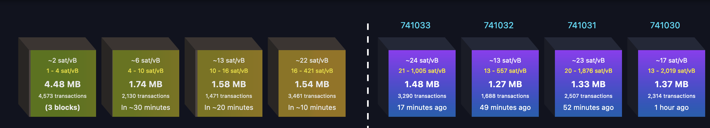
Image: [https://mempool.space/](https://mempool.space/) - the Bitcoin mempool

### Memory problems with NodeJS

As I mentioned in [Block size](#block-size), I had issues with the size on disk/memory. If you set the difficulty too high in the blockchain, NodeJS crashes after a few minutes, because the memory is too much used. In summary: C/C++ would be better.

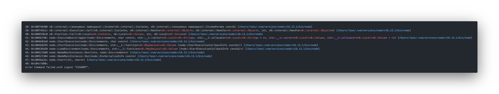

### My time in ZLI

About 60% of the time at work, I helped others, because we were only allowed to ask 3 questions to the coaches 😡, so everyone came to me. Afterwards I think, it would be better, if i'd say more "no" to co-workers, but I am just too nice.

### In Summary

If I could do the project again, but better, I would definitely do it again. It was very fun and I learned so much about how Blockchains work, especially Bitcoin, because it was my main inspiration. I still think that more time would be really profitable, I'd say 20 - 24 days instead of 12 days. Our coach [@diegosteiner](https://github.com/diegosteiner) was very helpful and always supported me, when I needed help.
