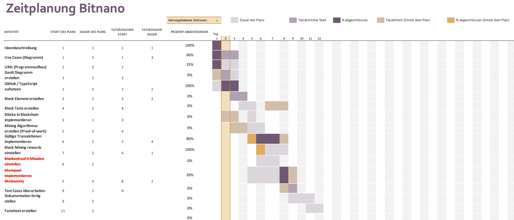

# Bitnano - Documentation <!-- omit in toc -->

## Table of contents <!-- omit in toc -->

- [Introduction](#introduction)
- [The idea](#the-idea)
  - [Description](#description)
  - [UML Diagrams](#uml-diagrams)
  - [Use case diagram](#use-case-diagram)
- [Class Diagram](#class-diagram)
- [Time schedule](#time-schedule)
- [Realization](#realization)
- [Test cases](#test-cases)

## Introduction

The Bitcoin protocol is the most popular cryptographic protocol worldwide. Since I am a big fan of Bitcoin and its protocol, I always wanted to create something similar my own. This is how i came to [the idea](#the-idea) of Bitnano as a final project in the Zürcher Lehrbetriebsverband ICT.

## The idea

### Description

Traditional banks need time and trust to process a transfer. Bitcoin replaces (central) banks with a decentral Blockchain. In the Bitcoin Blockchain, a Block has a maximum size of **1 MiB**. Approximately every **10 minutes** a new Block gets mined.
The idea of Bitnano is to create a faster Blockchain, but with a lower size of Blocks. The maximum size of a Bitnano-Block is **512 KiB**, with an average time of **5 minutes** per Block to mine.

For more information about the Bitcoin-Protocol: https://bitcoin.org/bitcoin.pdf

### UML Diagrams

### Use case diagram

## Class Diagram

## Time schedule

## Realization

## Test cases
